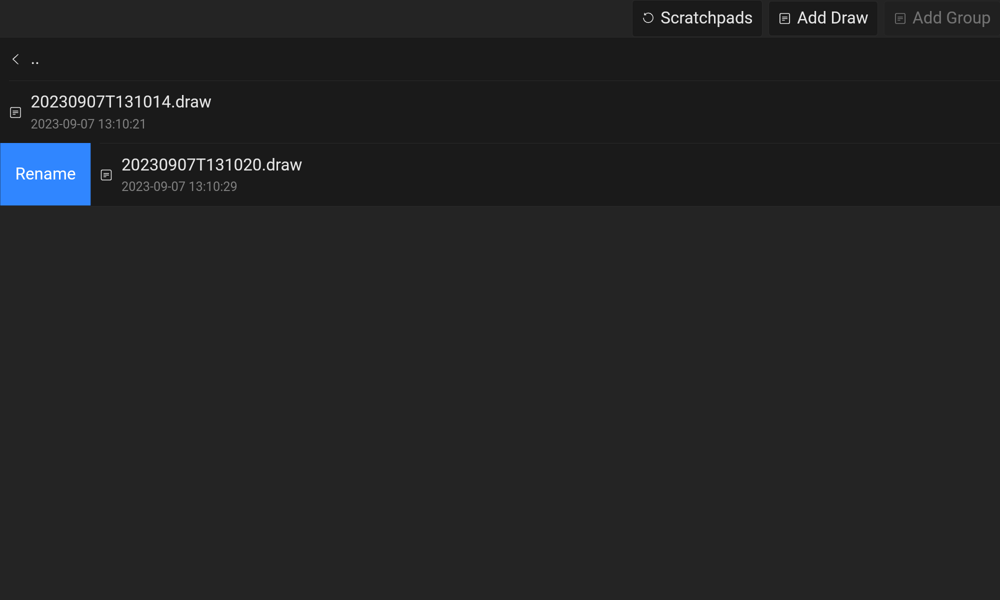
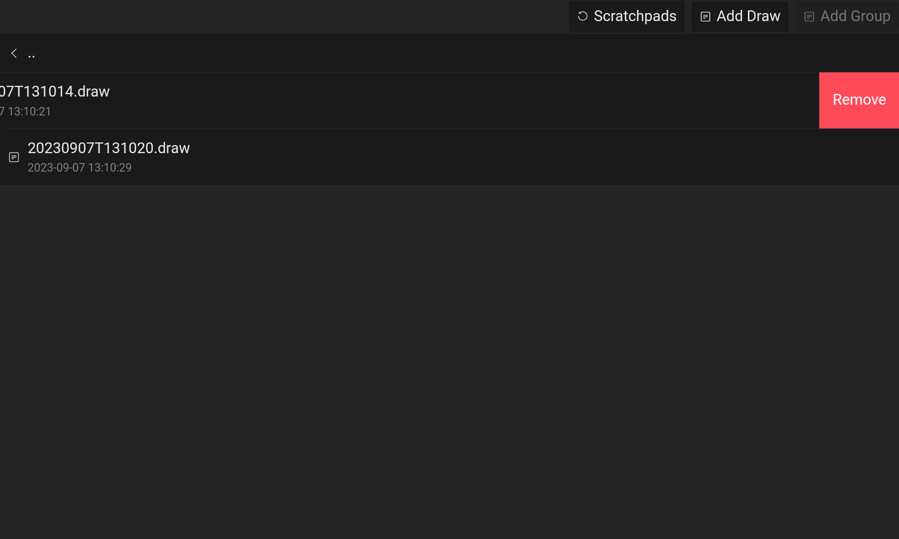
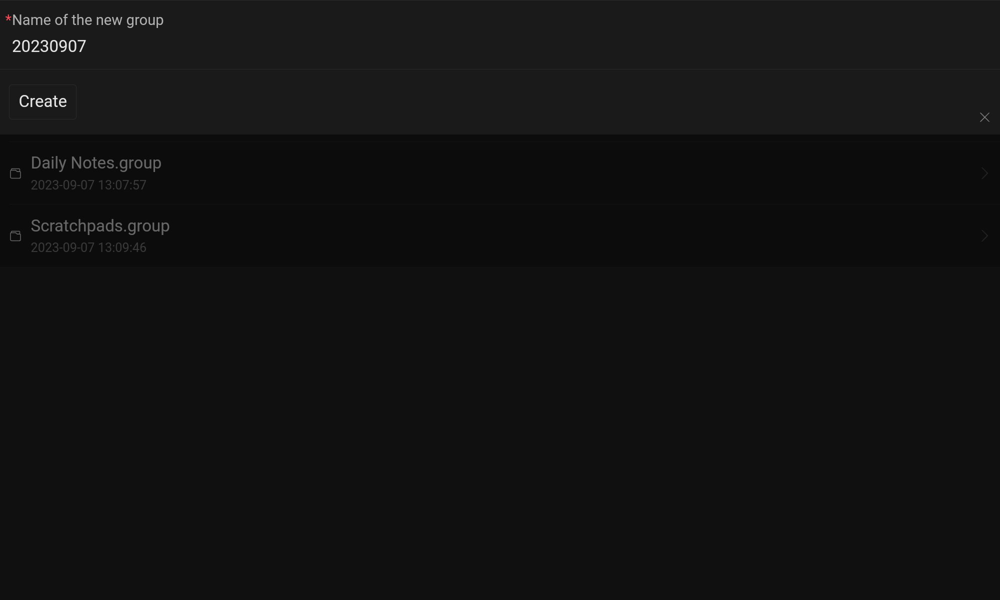

# Nldraw (WIP)

> A native wrapper for [tldraw](https://tldraw.com)

## Description

This project is a quick note-taking and sketching tool built on top of the
[tldraw](https://tldraw.com) library. It provides a simple interface for users
to jot down notes and create sketches on-the-go. With a focus on offline usage,
this tool allows users to store and access their data locally, eliminating the
need for constant communication with a remote server. Whether you're in a remote
area with limited internet connectivity or simply prefer to keep your data
local, this project offers the flexibility to work offline using the local
filesystem.

Please note that this project is intended for personal use and experimentation.
It is not actively maintained, and none of the features mentioned in the roadmap
are currently scheduled for development.

## Features

> WIP
>
> All the files are stored in the public Documents folder with the name Nldraw.

- [x] Use [tldraw](https://tldraw.com) snapshot with native filesystem instead
      of localStorage.

### Screenshots

> WIP

<table>
  <tbody>
    <tr>
      <td>
        
      </td>
      <td>
        
      </td>
    </tr>
    <tr>
      <td>
        
      </td>
      <td>
        
      </td>
    </tr>
  </tbody>
</table>

## Installation

> WIP
>
> Still not ready for daily usage.

### From [Releases](https://github.com/tulx17/nldraw/releases)

### From [Artifact](https://github.com/tulx17/nldraw/actions/workflows/ci.yml) (test build)

### Build it your self

Check [Capacitor](capacitorjs.com) for more details.

## Roadmap

> WIP

- [x] Open/Save draws in default location.
- [ ] App configuration.
  - [ ] ~~Custom default location.~~
  - [x] Toggle color scheme (light,dark).
  - [ ] ~~Privacy screen (prevent screenshots).~~
  - [ ] ~~Biometric authentication.~~
- [ ] Remove web specific features.
- [ ] Replace attachments embedding with reference links.
  - [ ] Use custom component to render linked attachments (image,voice,...).
- [ ] Apply template from existing draws.
- [ ] Support tags and filter based on tags.
- [ ] Update notification.
- [ ] IOS support (no promised).

## Core Libraries

**Client:** React, Ant Design Mobile, Tldraw.

**Native:** Capacitor.

## Contributing

This project is not actively seeking contributions at the moment. However, if
you have any bug reports or suggestions, feel free to open an issue in the
repository.

## License

### Third-Party Libraries

- [tldraw](https://tldraw.com) is used as the underlying library for the
  sketching functionality. Please refer to the
  [tldraw repository](https://github.com/tldraw/tldraw) for more information
  about its license and usage.

## FAQ
